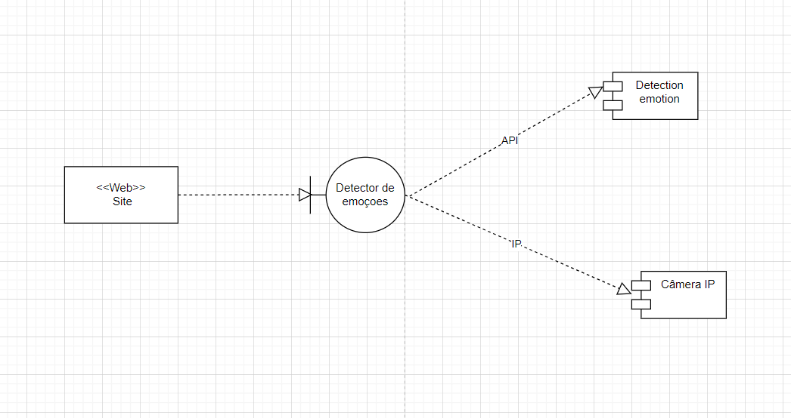

Artefatos:

Sistema para detecção de emoções

Vou usar a api face-api.js com reconhecimento facial diretamente da câmera no notebook, para versão final, penso em conectar com uma camera Ip, as emoções de cada usuário ficam gravadas no seu painel de controle pessoal.

Diagrama de banco de dados:

Diagrama de componentes:

Documento de visão:

https://1drv.ms/w/s!AjtCtdH-bFI1q_9f9gREzmGRzjzlGw?e=0lEqxh

Banco de dados MySql:

Ainda vou inserir aqui ***

Projeto para detecção de emoções em tempo real.

Nesse projeto é usado a api que está nesse site: https://justadudewhohacks.github.io/face-api.js/docs/index.html

Para implementação de gravação de emoções em textos fiz algumas alterações:

1- instalei o node no computador

2- instalei no projeto apenas com npm init

3- instalei o nodemon

4- criei o server em MySql com o xampp

5- fiz o banco com duas tabelas, user e emotion

5.1 user: id, name, email, password

5.2 emotion: timestamp, emocao, user_id
6- inicio o server no terminal com nodemon server.js

7- usei a extensão Live server e inicio o projeto na página SignIn.html