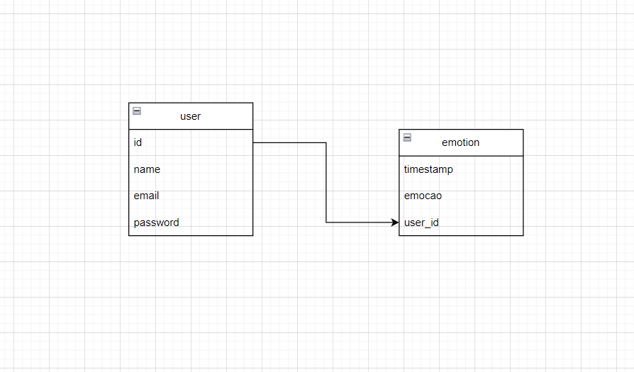
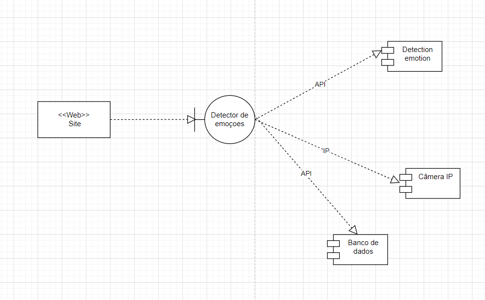

Artefatos:

Sistema para detecção de emoções

Vou usar a api face-api.js com reconhecimento facial diretamente da câmera no notebook, para versão final, penso em conectar com uma camera Ip, as emoções de cada usuário ficam gravadas no seu painel de controle pessoal.

Diagrama de banco de dados:

Diagrama de componentes:

Documento de visão:

https://1drv.ms/w/s!AjtCtdH-bFI1q_9f9gREzmGRzjzlGw?e=0lEqxh

Banco de dados MySql está na pasta principal com o nome emotiondetection.sql, já está povoado com alguns dados para facilitar a instalação.

Projeto para detecção de emoções em tempo real.

Nesse projeto é usado a api que está nesse site: https://justadudewhohacks.github.io/face-api.js/docs/index.html

Para implementação são necessário no computador:

1- VsCode

2- Node Js

3- Xammp

4- Ter instalado o npm (npm install -g npm)

Agora siga esses passos
1- baixe e instale no projeto apenas com (npm install)

2- instale o nodemon (npm install -g nodemon)

3- criei o banco em MySql com o xampp usando o arquivo emotiondetection.sql

4- inicie o server no terminal com nodemon server.js

5- usei a extensão Live server e inicie o projeto na página SignIn.html